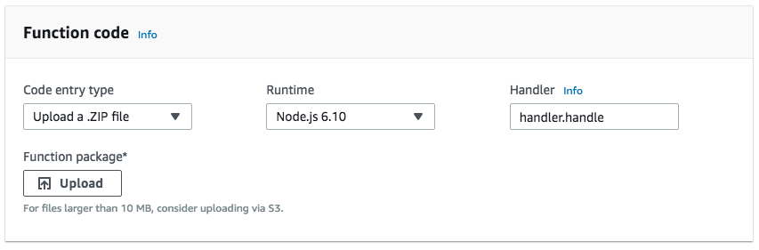

class: main-title

# Serverless & *PHP*

---
class: profile

## Matthieu Napoli [@matthieunapoli](https://twitter.com/matthieunapoli)

### [github.com/mnapoli](https://github.com/mnapoli)

### [prettyci.com](http://prettyci.com)

---
class: title

# Serverless

---
class: serverless-analogy

.slide-left[
Taxi
    
Rental
    
Owning a car
]

---
class: serverless-analogy

.slide-left[
Taxi
    
Rental
    
Owning a car
]
.slide-right[
Serverless
    
The Cloud
    
Bare metal
]

???
- availability/scaling
- costs
- maintenance
- risks/accidents/security
- privacy

---
class: serverless-analogy

.slide-left[
*Taxi*
    
Rental
    
Owning a car
]
.slide-right[
*Serverless*
    
The Cloud
    
Bare metal
]

???
Taxi and Serverless are services, whereas the rest are resources.

---
class: main-title

# Resource vs *Service*

???
Serverless or resourceless?

"Less" = not caring about it. There are servers.

Service = on demand

---

- Storage *as a service*
    - AWS S3
    
--

- Database *as a service*
    - DynamoDB
    - Aurora Serverless
    - Azure Cosmos DB
    - Firebase
    
--

- Execution *as a service*/FaaS
    - AWS Lambda
    - Google Cloud Functions
    - Azure Functions

???
Pay for what you use

---
class: title

# FaaS

---

HTTP server => HTTP request handler

--

Worker => Job handler

???
Java, Node, Go, etc. HTTP apps boot their own server and keep it alive. Faas is a shift in the architecture where the HTTP server is taken out of the application. The application becomes the request handler.

This is how PHP has been working forever!

---



???

Runs `handle()` function in `handler.js`.

---

## Python

```python
def handler(event, context):
    return 'hello ' + event['name']
```

## Javascript

```js
exports.handler = function (event, context, callback) {
    let result = 'hello ' + event.name;

	callback(null, result);
};
```

---

## Bref [github.com/mnapoli/bref](https://github.com/mnapoli/bref)

```php
require 'vendor/autoload.php';

λ(function (array $event) {
    return [
        'hello' => $event['name'],
    ];
});
```

---

```php
use ...;

$kernel = new App\Kernel(...);

// $request = Request::createFromGlobals();
// $response = $kernel->handle($request);
// $response->send();
// $kernel->terminate($request, $response);

$bref = new Bref\Application;
$bref->httpHandler(new SymfonyAdapter($kernel));
$bref->run();
```

---

```bash
$ bin/console doctrine:query:sql 'SELECT * FROM product'
# ...

$ bref cli -- doctrine:query:sql 'SELECT * FROM product'
# ...
```

---

## Use case #1 [returntrue.win](https://returntrue.win/)

- Web lambda
- Runner lambda
- DynamoDB

--

350k HTTP requests in 2 weeks, 700k total

Cost: **$3**

---

## Use case #2 [prettyci.com](https://prettyci.com/)

worker/job queue => lambda

--


--


