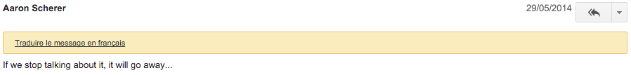

class: center, middle

# PSR 0 to 12
# in 12 minutes

---
# PHP-FIG

- PHP *Framework Interop Group*
- 44 projects (frameworks, libraries, applications, ...)
- 6 bylaws
- 1024 mail threads

---
class: drama

# Drama

---

# PSR-0
--

- Autoloading standard

```php
Vendor\Project\Classname => {dir}/Vendor/Project/Classname.php
```

## Deprecated!

---
class: drama

# PSR-1 & 2
--

### PSR-1: basic coding style

### PSR-2: advanced coding style

---

# PSR-3
--

```php
interface LoggerInterface
{
    public function error($message, array $context = []);

    public function warning($message, array $context = []);

    ...
}
```

- `psr/log`: 20 000 000 installs

### Implementations:
--

- Monolog

---

# PSR-3

Use the context Luke:

```php
// Don't
$logger->info('User ' . $user->getName() . ' paid order ' . $order->getId());

// Do
$logger->info('User {user} paid order {order}', [
    'user' => $user->getName(),
    'order' => $order->getId(),
]);
```
--

Logging exceptions:

```php
catch (\Exception $e) {
    $logger->warning('Issues could not be imported from GitHub', [
        'exception' => $e,
    ]);
}
```

---
class: drama

# PSR-4
--

- Autoloading standard
- replaces PSR-0

PSR-0:

```php
src/Acme/Blog/User.php
```

PSR-4:

```php
src/User.php
// or
src/Acme/Blog/User.php
```

---

# PSR-5
--

### Status: draft

- PHPDoc standard
- 2130 lines, 63 Kb

```php
/**
 * This is a Summary.
 *
 * @param int        $parameter1 A parameter description.
 * @param \Exception $parameter2 Another parameter description.
 *
 * @return string
 */
function test($parameter1, $parameter2) {}
```

---
class: drama

# PSR-6
--

### Status: accepted (dec. 2015)

- Cache interfaces

```php
interface CacheItemPoolInterface
{
    public function getItem($key);
    public function save(CacheItemInterface $item);
    ...
}
```

```php
interface CacheItemInterface
{
    public function get();
    public function set($value);
    ...
}
```

---
class: drama

# PSR-6

```php
interface CacheItemPoolInterface
{
    public function getItem($key);
    public function save(CacheItemInterface $item);
    public function hasItem($key);
    public function deleteItem($key);
    public function getItems(array $keys = array());
    public function deleteItems(array $keys);
    public function clear();
    public function saveDeferred(CacheItemInterface $item);
    public function commit();
}
```

```php
interface CacheItemInterface
{
    public function get();
    public function set($value);
    public function getKey();
    public function isHit();
    public function expiresAt($expiration);
    public function expiresAfter($time);
}
```

---

# PSR-7
--

### Status: accepted

- `RequestInterface` + `ServerRequestInterface`
- `ResponseInterface`
- ...

`psr/http-message`: 2 283 649 installs

---

# PSR-7

### Middlewares

```php
function (
    ServerRequestInterface $request,
    ResponseInterface $response,
    callable $next
) : ResponseInterface
{
    return $next($request, $response);
}
```

- [Slim v3](http://www.slimframework.com/)
- [Zend Stratigility](https://github.com/zendframework/zend-stratigility)
- [Zend Expressive](https://github.com/zendframework/zend-expressive)
- [Relay](http://relayphp.com/)

---
class: drama

# PSR-8
--

### Status: draft

```php
interface Huggable
{
    /**
     * Hugs this object.
     */
    public function hug(Huggable $h);
}

interface GroupHuggable extends Huggable
{
  /**
   * Hugs a series of huggable objects.
   */
  public function groupHug($huggables);
}
```

---
class: drama

# PSR-8




---

# PSR-9 & 10
--

### Status: draft

- PSR-9: report security issues
- PSR-10: learn about security issues

---
class: drama

# PSR-11
--

### Status: draft

```php
interface ContainerInterface
{
    public function get(string $id);
    public function has(string $id) : bool;
}
```

- [container-interop](https://github.com/container-interop/container-interop)

---
class: drama

# PSR-12
--

### Status: draft

- PSR-2++

---
class: center, middle

# Bonus!

---

# PSR-13?

### Status: [entrance vote](https://groups.google.com/forum/#!topic/php-fig/hqQZWHRC8sg)

- Hypermedia links (HTML, HAL, JSON API, XML, …)

```php
interface LinkInterface
{
    public function getHref() : string;
    public function getRel() : array;
    public function getAttributes() : array;
}
```

```php
interface LinkableInterface
{
    public function getLinks() : array;
    ...
}
```

---
class: drama

# PSR-14?

### Status: [pre-draft](https://groups.google.com/forum/#!topic/php-fig/AI-3BH1DT3A)

- Container configuration
- [META document](https://github.com/container-interop/fig-standards/blob/container-configuration/proposed/container-configuration-meta.md)
- [definition-interop](https://github.com/container-interop/definition-interop)

---
class: center, middle

# [Mailing list](https://groups.google.com/forum/#!forum/php-fig)


---
class: center, middle

# [php-fig.org](http://php-fig.org)
