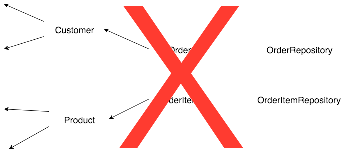

class: title

# Get Off My Domain


---
class: center

# Domain -> Model -> Patterns

---
class:

# Domain Driven Design ?

- UI driven design ?
- App driven design ?
- Infrastructure driven design ?

---
class: center

# Design

driven by the

# Domain

---
class: center

# Developers

and

# Domain experts

---
class: center

# Travail collaboratif

Métier &nbsp; &nbsp; &nbsp; &nbsp; *ubiquitous language* &nbsp; &nbsp; &nbsp; &nbsp; Devs

 &nbsp; &nbsp; &nbsp; &nbsp; &nbsp; &nbsp; &nbsp; &nbsp; &nbsp; &nbsp; &nbsp; &nbsp; &nbsp; &nbsp; &nbsp; &nbsp; &nbsp; &nbsp; &nbsp; &nbsp; &nbsp; &nbsp; 

---
class: center

# Travail itératif

Le métier vit

Acceptons le changement

---
class: title

# Modélisation

---
class: center

# Core domain

vs

# Supporting subdomains

---
class: center

# Complexité

## technique ≠ métier

---
class: center

# Utile > Réalisme

---
class: center

# State and Behavior

---
class: title

# Le métier

---


> Quand je paye une commande elle passe au statut validée

```php
public function payAction($id)
{
    $order = $this->entityManager->find($id);
    
    $order->setStatus('F');
    
    $this->entityManager->persist($order);
    
    return $this->twig->render('order-confirmation.twig');
}
```

---
class: title

# Patterns

---

- Entity
- Value Object
- Service
- Repository
- Aggregate
- Event

---
class: title

# Entity

---

```php
class Order
{
    /**
     * @var string
     * @Column(type="string")
     */
    private $status;

    public function getStatus() {…}
    public function setStatus($status) {…}
}
```

Payer une commande :

```php
$order->setPaidAmount(100);
$order->setStatus('F');
```

---
class: center

# State and Behavior

## ~~data model~~

---

```php
$order->setPaidAmount(100);
$order->setStatus('F');
```

---

```php
public function pay(int $amount) {
    $this->amountPaid = $amount;
    $this->status = 'F';
}

$order->pay(100);
```

---

- éviter les getters/setters

- encapsuler les comportements

- ubiquitous language

---
class: center

# Protecting invariants

---


> Une commande doit **toujours** avoir un client et des produits

> Une nouvelle commande est **forcément** au statut "nouvelle"

---

```php
$order = new Order();
$order->setCustomer($customer);
$order->setProducts($products);
$order->setStatus('N');
```

---

```php
public function __construct(Customer $customer, array $products) {
    $this->customer = $customer;
    $this->products = $products;
    $this->status = 'N';
}

$order = new Order($customer, $products);
```

---
class: center

# Protecting invariants

## users and developers

---


> Ah mais quand ils font leur shopping, les clients peuvent construire une commande vide et ajouter des produits au fur et à mesure.

---

Différents modèles pour différents contextes :

```php
$basket = new Basket($customer);
$basket->addProduct($product1);
$basket->addProduct($product2);

$order = $basket->pay();
```
--

CQRS ?

---


> Comment est-ce qu'un client **construit** un panier ?


> Construit ?

---

Constructeurs nommés :

```php
$basket = Basket::pickup($customer);

$basket = Basket::fromWishlist($wishlist);

$basket = $wishlist->toBasket();
```

---


> On ne peut payer qu'avec un montant positif (duh)

```php
$order->pay(100);
```

```php
$order->pay(-100);
```

```php
$order->pay(PHP_INT_MAX + 1);
```

---
class: title

# Value Object

---

| Entity            | Value Object   |
|-------------------|----------------|
| Equal by identity | Equal by value |
| Lifecycle         | Immutable      |

---

```php
class Money
{
    public function __construct($amount)
    {
        $this->amount = $this->checkInt($amount);
    }

    public function multiply(int $multiplier) : Money
    {
        $amount = $this->round($this->amount * $multiplier);
    
        return new self($amount);
    }
}
```

---

```php
class OrderStatus extends Enum
{
    const NEW = 'N';
    const PAID = 'P';
}

$status = OrderStatus::NEW();
$status = OrderStatus::PAID();
```

- [MyCLabs\PhpEnum](https://github.com/myclabs/php-enum)
- [Doctrine Enum Type](https://github.com/acelaya/doctrine-enum-type)

---

Un billet de 10 euros ?

---


> On veut détecter si une commande est une fraude basée sur
> - son montant
> - son contenu
> - les infos du client
> - l'historique de commandes

---
class: title

# Domain Service

---


> Un client peut voir la liste de ses commandes.


> Ah non mais ça c'est de la persistence, c'est pas du métier chut chut.


> Plait-il ?

---
class: title

# Repository

---
class: right

> A repository […] acts like a collection, except with more elaborate querying capability.

[Eric Evans](https://books.google.fr/books/about/Domain_driven_Design.html?id=7dlaMs0SECsC&hl=fr)

---

```php
interface OrderRepository
{
    public function add(Order $order);

    public function remove(Order $order);

    public function get(int $id) : Order;

    public function getAll() : array;

    /**
     * @return Order|null
     */
    public function findByCode(int $orderCode);
}
```

---

### Domain

```php
interface OrderRepository
{
}
```

### Infrastructure

```php
class ArrayOrderRepository implements OrderRepository
{
}
```

```php
class DoctrineOrderRepository implements OrderRepository
{
}
```

---
class: title

# Aggregate

---
class: center


---
class: center



---
class: center


---


> Quand une commande est annulée, le vendeur doit être averti.

---
class: title

# Domain Event

---

# Domain modeling

- Core domain vs Supporting subdomains
- Utile > Réalisme
- State and Behavior

---
class: title

# Questions ?
