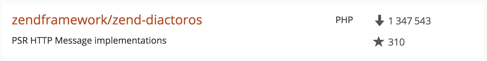

class: main-title

### Conclusion :

# Un *middleware* est quelque chose qui prend une *requête* et retourne une *réponse*.

---
class: profile

.profile-picture[
    
]

## Matthieu Napoli [github.com/mnapoli](https://github.com/mnapoli)

.company-logo[ [](https://wizaplace.com) ]

---

# middle-what ?

---
class: main-title

# Un *middleware* est quelque chose qui prend une *requête* et retourne une *réponse*.

---

# Singleton

---
class: main-title

# Un *singleton* est une classe qui a *une seule instance*.

---
class: main-title

# Un *middleware* est quelque chose qui prend une *requête* et retourne une *réponse*.

---

## 1. Les middlewares **dans** les frameworks
## 2. Les middlewares **sans** les frameworks

---
class: section

# 1. Les middlewares **dans** les frameworks

---
class: title

# Symfony

---

```php
$request = Request::createFromGlobals();

try {
    $this->dispatcher->dispatch(KernelEvents::REQUEST, new Event(...));
    if ($event->hasResponse()) { ... }

    $controller = $request->attributes->get('_controller');
    $controllerArguments = $this->resolver->getArguments($request, $controller);

    $response = call_user_func_array($controller, $controllerArguments);
} catch (\Exception $e) {
    $response = $this->handleException($e, $request);
}

$response->send();
$this->dispatcher->dispatch(KernelEvents::TERMINATE, new Event(...));
```

---

# Events

---

# Hooks ?

---

```php
$kernel = new AppKernel();

$request = Request::createFromGlobals();

$response = $kernel->handle($request);

$response->send();
```

---
class: main-title

# Un *middleware* est quelque chose qui prend une *requête* et retourne une *réponse*.

---

```php
interface HttpKernelInterface
{
    /**
     * @return Response
     */
    public function handle(Request $request, ...);
}
```

---

## Stack [stackphp.com](http://stackphp.com/)


---

```php
class LoggerMiddleware implements HttpKernelInterface
{
    public function __construct(HttpKernelInterface $next)
    {
        $this->next = $next;
    }

    public function handle(Request $request, …)
    {
        $response = $this->next->handle($request, …);
        
        // write to log
        
        return $response;
    }
}
```

---

```php
$kernel = new LoggerMiddleware(
    new AppKernel()
);

$request = Request::createFromGlobals();

$response = $kernel->handle($request);

$response->send();
```

---

.left-block[
## Events

- architecture figée
- spécifique Symfony
- dans l'application
- utilisation facile
]
.right-block[
## Middlewares Stack

- architecture libre
- spécifique Symfony
- hors de l'application
- utilisation complexe

```php
$kernel = new HttpCache(
    new CorsMiddleware(
        new LoggerMiddleware(
            new AppKernel()
        ),
    ),
    new Storage(...)
);
```
]

---

- spécifique Symfony
- hors de l'application
- utilisation complexe

---
class: title

# PSR-7

---

## PSR-7

```
composer require psr/http-message
```

- `RequestInterface`
- `ServerRequestInterface`
- `ResponseInterface`
- ...

---

TODO : à supprimer ?

## PSR-7: immutabilité

```php
$request = $request->withQueryParams([
    'foo' => 'bar'
]);
```

```php
$response = $response->withHeader('Content-Length', 123);
```

---

TODO : à supprimer ?

Immutabilité => ~~events~~

---
class: title

# Pipe

---

TODO : graphique pipe

---

```php
class LoggerMiddleware
{
    public function __construct($next)
    {
        $this->next = $next;
    }

    public function handle(RequestInterface $request)
    {
        $response = $this->next->handle($request);
        
        // write to log
        
        return $response;
    }
}
```

---

```php
class LoggerMiddleware
{
    public function handle(RequestInterface $request, $next)
    {
        $response = $next->handle($request);
        
        // write to log
        
        return $response;
    }
}
```

---

```php
$middleware = function (RequestInterface $request, callable $next) {
    $response = $next($request);
    
    // write to log
    
    return $response;
}
```

---

/!\

```php
$middleware = function ($request, $response, $next) {
    $response = $next($request, $response);
    
    // write to log
    
    return $response;
}
```

---

```php
$middleware = function (RequestInterface $request, callable $next) {
    $response = $next($request);
    
    // write to log
    
    return $response;
}
```

---

.left-block[
```php
$pipe = new Pipe([
    function ($request, $next) {
        ...
    },
    function ($request, $next) {
        ...
    },
    function ($request, $next) {
        ...
    },
]);
```
]
.right-block[
```php
$pipe = new Pipe();

$pipe->pipe(function ($request, $next) {
    ...
});
$pipe->pipe(function ($request, $next) {
    ...
});
$pipe->pipe(function ($request, $next) {
    ...
});
```
]

---
class: title

# Zend Expressive/ZF3

---

```php
$app = Zend\Expressive\AppFactory::create();

$app->get('/', function ($request, $response, $next) {
    $response->getBody()->write('Hello, world!');
    return $response;
});

$app->pipe(function ($request, $response, $next) {
    $response = $next($request, $response);
    // write to log
    return $response;
});
$app->pipe('nom-de-service');

// ...
$app->run();
```

---
class: title

# Slim

---

```php
$app = new \Slim\App();

$app->add(function ($request, $response, $next) {
	// ...
});

// Route middleware
$app->get('/', function ($request, $response, $args) {
	// controller
})->add(function ($request, $response, $next) {
    // middleware
});
```

---
class: title

# Laravel

---

```php
class MyMiddleware
{
    public function handle(Request $request, Closure $next)
    {
        // ...

        return $next($request);
    }
}
```

```php
class Kernel extends HttpKernel
{
    protected $middleware = [
        CheckForMaintenanceMode::class,
    ];
    
    ...
```

---
class: title

# Conclusion

---
class: section

# 2. Les middlewares **sans** les frameworks

---

- application
- pipe
- routeur
- controleur

---
class: full-image


---
class: main-title

# Un *middleware* est quelque chose qui prend une *requête* et retourne une *réponse*.

---
class: title

# Concrètement

---

```php
$response = middleware($request);
```

```php
function middleware($request) {
    return new Response('Hello');
}
```

---

```php
use Psr\Http\Message\ResponseInterface;
use Psr\Http\Message\ServerRequestInterface;

function middleware(ServerRequestInterface $request) : ResponseInterface {
    return new Response();
}
```

---

## Zend Diactoros [github.com/zendframework/zend-diactoros](https://github.com/zendframework/zend-diactoros)



---

## Request

```php
$request = new ServerRequest(
    $_SERVER,
    $_FILES,
    new Uri(...),
    $_SERVER['REQUEST_METHOD'],
    'php://input',
    $headers,
    $_COOKIE,
    $_GET,
    $_POST,
    $_SERVER['SERVER_PROTOCOL']
);
```

```php
$request = ServerRequestFactory::fromGlobals();
```

---

## Response

```php
foreach ($response->getHeaders() as $header => $values) {
    foreach ($values as $value) {
        header("$header: $value");
    }
}
echo $response->getBody();
```

```php
(new SapiEmitter)->emit($response);
```

---
class: title

# Application

---
class: main-title

# Un *middleware* est quelque chose qui prend une *requête* et retourne une *réponse*.

---

```php
// index.php

$application = function (ServerRequestInterface $request) {
    return new TextResponse('The date is ' . date('d M Y'));
};

$response = $application(…);
…
```

---

```php
// index.php

$application = function (ServerRequestInterface $request) {
    return new TextResponse('The date is ' . date('d M Y'));
};

$response = $application(ServerRequestFactory::fromGlobals());
…
```

---

```php
// index.php

$application = function (ServerRequestInterface $request) {
    return new TextResponse('The date is ' . date('d M Y'));
};

$response = $application(ServerRequestFactory::fromGlobals());
(new SapiEmitter)->emit($response);
```

---

.browser-mockup[ The date is 28 Oct 2016 ]

---
class: title

# Error handling

---

```php
$application = function (ServerRequestInterface $request) {
    try {
        return new TextResponse('The date is ' . date('d M Y'));
    } catch (\Throwable $e) {
        return new EmptyResponse('Oops!', 500);
    }
};

$response = $application(ServerRequestFactory::fromGlobals());
(new SapiEmitter)->emit($response);
```

---

```php
$application = function (ServerRequestInterface $request) {
    return new TextResponse('The date is ' . date('d M Y'));
};

$errorHandler = function (ServerRequestInterface $request) use ($application) {
    try {
        return $application($request);
    } catch (\Throwable $e) {
        return new EmptyResponse('Oops!', 500);
    }
};

$response = $errorHandler(ServerRequestFactory::fromGlobals());
(new SapiEmitter)->emit($response);
```

---

```php
$application = function (ServerRequestInterface $request) {
    return new TextResponse('The date is ' . date('d M Y'));
};

$errorHandler = function (ServerRequestInterface $request, callable $next) {
    try {
        return $next($request);
    } catch (\Throwable $e) {
        return new EmptyResponse('Oops!', 500);
    }
};

$response = $errorHandler(ServerRequestFactory::fromGlobals(), $application);
(new SapiEmitter)->emit($response);
```

---

.browser-mockup.error[ Oops! ]

---
class: title

# Force HTTPS

---

```php
$forceHttps = function (ServerRequestInterface $request, callable $next) {
    $uri = $request->getUri();
    if (strtolower($uri->getScheme()) !== 'https') {
        $uri = $uri->withScheme('https')->withPort(443);
        return new RedirectResponse($uri);
    }
    return $next($request);
};
```

---

```php
$errorHandler = function (ServerRequestInterface $request, callable $next) {
    ...
};

$forceHttps = function (ServerRequestInterface $request, callable $next) {
    ...
};

$application = function (ServerRequestInterface $request) {
    return new TextResponse('The date is ' . date('d M Y'));
};

$response = $errorHandler(ServerRequestFactory::fromGlobals(), $forceHttps);
(new SapiEmitter)->emit($response);
```

---
class: title

# Pipe

---

```ruby
$ cat /var/log/apache2/access.log \
        | grep 404 \
        | awk '{ print $7 }' \
        | sort \
        | uniq -c \
        | sort

   1 /blog/wp-content/uploads/2012/12/favicon.ico
   1 /favicon.ico
   1 /login?code=auie&state=auie
  10 /dreams/wp-content/uploads/2016/03/header-bg.png
  33 /description.xml
```

---

## Unix philosophy

- Write programs that do one thing and do it well.
- Write programs to handle text streams, because that is a universal interface.
- Write programs to work together.

.small[ Peter H. Salus ]

---

- Write **middlewares** that do one thing and do it well.
- Write **middlewares** to handle **PSR-7 objects** because that is a universal interface.
- Write **middlewares** to work together.

---

```ruby
$ cat access.log | grep 404 | awk '{ print $7 }' | sort
```

---

.left-block[
```php
$pipe = new Pipe([
    function ($request, $next) {
        ...
    },
    function ($request, $next) {
        ...
    },
    function ($request, $next) {
        ...
    },
]);
```
]

--

.right-block[
```php
$pipe = new Pipe();

$pipe->pipe(function ($request, $next) {
    ...
});
$pipe->pipe(function ($request, $next) {
    ...
});
$pipe->pipe(function ($request, $next) {
    ...
});
```
]

---

```php
class Pipe
{
    private $middlewares;

    public function __construct(array $middlewares)
    {
        $this->middlewares = $middlewares;
    }

    public function __invoke(ServerRequestInterface $request, callable $next)
    {
        foreach (array_reverse($this->middlewares) as $middleware) {
            $next = function ($request) use ($middleware, $next) {
                return $middleware($request, $next);
            };
        }

        return $next($request);
    }
}
```

---

## Invokable class

```php
class Pipe
{
    public function __invoke(...) { ... }
}

$pipe = new Pipe(...);

$response = $pipe($request);
$response = $pipe->__invoke($request);
```

[PHP callables](http://php.net/manual/en/language.types.callable.php)

---

```php
$pipe = new Pipe([

    function ($request, $next) {
        // error handler
    },
    
    function ($request, $next) {
        // force https
    },
    
    function ($request, $next) {
        return new TextResponse('The date is ' . date('d M Y'));
    },
    
]);
```

---
class: main-title

# Un *middleware* est quelque chose qui prend une *requête* et retourne une *réponse*.

---

```php
$application = new Pipe([
    ...
]);

$next = function () {
    throw new Exception('No middleware handled the response');
};
$response = $application(ServerRequestFactory::fromGlobals(), $next);
(new SapiEmitter)->emit($response);
```

---
class: title

# Routing

---

```php
$router = new Router();
$router->addRoute('/', function () {
    return new TextResponse('The date is ' . date('d M Y'));
});
$router->addRoute('/about', function () {
    return new TextResponse('This super website is sponsored by AFUP!');
});
```
---

```php
$router = new Router(...

$application = new Pipe([
    function (...) { /* error handler */ },
    function (...) { /* force https */ },
]);

$next = function () { throw new ... };
$response = $application(ServerRequestFactory::fromGlobals(), $next);
(new SapiEmitter)->emit($response);
```

---
class: main-title

# Un *middleware* est quelque chose qui prend une *requête* et retourne une *réponse*.

---

```php
$router = new Router(...

$application = new Pipe([
    function (...) { /* error handler */ },
    function (...) { /* force https */ },
    $router,
]);

$next = function () { throw new ... };
$response = $application(ServerRequestFactory::fromGlobals(), $next);
(new SapiEmitter)->emit($response);
```

---

```php
$application = new Pipe([
    function (...) { /* error handler */ },
    function (...) { /* force https */ },
    new Router([
        '/' => function (...) {
            ...
        },
        '/about' => function (...) {
            ...
        },
    ]),
]);

$next = function () { throw new ... };
$response = $application(ServerRequestFactory::fromGlobals(), $next);
(new SapiEmitter)->emit($response);
```

---
class: title

# Authentification

---

```php
$application = new Pipe([
    function (...) { /* error handler */ },
    function (...) { /* force https */ },
    function (...) { /* authentification */ },
    new Router([
        '/' => function (...) { ... },
        '/about' => function (...) { ... },
    ]),
]);
```

---

```php
$application = new Pipe([
    function (...) { /* error handler */ },
    function (...) { /* force https */ },
    function (...) { /* authentification */ },
    new Router([
        '/' => function (...) { ... },
        '/about' => function (...) { ... },
        '/api/date' => function (...) { ... },
        '/api/time' => function (...) { ... },
    ]),
]);
```

---

```php
$application = new Pipe([
    function (...) { /* error handler */ },
    function (...) { /* force https */ },
    new Router([
        '/' => function (...) { ... },
        '/about' => function (...) { ... },
        
        '/api/*' => new Pipe([
            function (...) { /* authentification */ },
            new Router([
                '/api/date' => function (...) { ... },
                '/api/time' => function (...) { ... },
            ]),
        ]),
    ]),
]);
```

---
class: title

# Lisibilité

---

```php
$application = new Pipe([
    new ErrorHandler,
    new ForceHttps,
    new Router([
        '/' => [new HomeController, 'home'],
        '/about' => [new HomeController, 'about'],
        
        '/api/*' => new Pipe([
            new AuthenticationMiddleware,
            new Router([
                '/api/date' => [new ApiController, 'date'],
                '/api/time' => [new ApiController, 'time'],
            ]),
        ]),
    ]),
]);
```

---

```php
$application = new Pipe([
    new ErrorHandler,
    new ForceHttps,
    new Router([
        require 'routes-website.php',
        
        '/api/*' => new Pipe([
            new AuthenticationMiddleware,
            new Router([
                require 'routes-api.php',
            ]),
        ]),
    ]),
]);
```

---
class: title

# Architecture

---

```php
$application = new Pipe([
    new ErrorHandler,
    new ForceHttps,
    new PrefixRouter([
        '/api/' => new Pipe([
            new AuthenticationMiddleware,
            new ContentNegociationMiddleware,
            new Router([
                require 'routes-api.php',
            ]),
        ]),
        
        '/' => new Pipe([
            new CacheMiddleware,
            new Router([
                require 'routes-website.php',
            ]),
        ]),
    ]),
]);
```

---

# TODO :

- avantages
- inconvénients
- attributes
- frameworks
- PSR-15
- middlewares PSR-7
