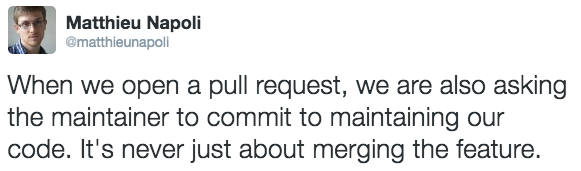
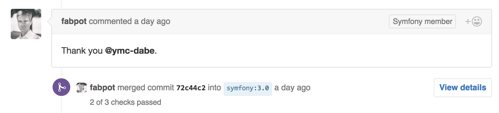

class: title

# Lancez-vous dans l'open source !


---

.profile-picture[
    
]

## Matthieu Napoli

[github.com/mnapoli](https://github.com/mnapoli)

<div class="clear"></div>


<hr>

- [PHP-DI](http://php-di.org/) - 725★ - 295 000⬇ - 2012
- [Couscous](http://couscous.io) - 399★
- [Silly](https://github.com/mnapoli/silly) - 274★ - 5 500⬇
- …

---

# Open source ?


---

Packagist.org 96 293 packages

---

# Pourquoi un projet open source "marche" ?

---


---


---

# Conteneurs

- Symfony DI: "The DIC is the biggest contributor to the speed and extensibility of Symfony"
--

- Pimple: "A simple DIC"

--
- PHP-DI: "The DIC for humans"

--
- Dice: "Lightweight and fast DIC"

--
- Twittee: "A DIC in a Tweet"

---

.center[  ]

---

## Standards & Conventions

```
src/
tests/
composer.json
```

- PSR-4
- PSR-1 & PSR-2

---

## MIT License [choosealicense.com](http://choosealicense.com/)

---


---


---

## Documentation

- README
- ~~GitHub wiki~~
- GitHub repository
- [Read the Docs](https://readthedocs.org/)
- [Couscous](http://couscous.io)

---

## Semantic Versioning [semver.org](http://semver.org/)

`MAJOR.MINOR.PATCH`

- 0.1.0
- 0.2.0
- 1.0.0

---
class: title

[github.com/mnapoli/project-template](https://github.com/mnapoli/project-template)

---

.full-image[ [](https://www.flickr.com/photos/aigle_dore/5951683083/in/photostream/) ]

---

| Twitter | Reddit [/r/php](http://fr.reddit.com/r/php) |
| --- | --- |
| Traffic | ! Traffic |
| Favs + Retweets | Criticism + Trolls |

---

.center[  ]

---



---


---


---

> Don’t try to be everything to everyone.

[Robby Russell](https://medium.freecodecamp.com/d-oh-my-zsh-af99ca54212c) (Oh My Zsh)

---



---

## What to expect?

- Alexander Makarov - Yii
- Jordi Boggiano - Composer
- Josh Lockhart - Slim
- William Durand
- Marco Pivetta - Doctrine, Zend Framework
- Matthew Weier O'Phinney - Zend Framework
- Paul Dragoonis - PPI
- Taylor Otwell - Laravel

---

## What to expect?

- Coding: 30%
- Documentation: 15%
- User support: 5%
- Project management: 50%

---

> Have fun!

???

- emails
- notifications
- unhappy users
- haters
