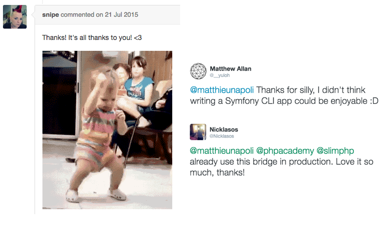

class: title

# Lancez-vous dans l'open source !


---

Y'a-t-il des contributeurs dans la salle ?

---
class: profile

.profile-picture[
    
]

## Matthieu Napoli [github.com/mnapoli](https://github.com/mnapoli)

.company-logo[ [](https://wizaplace.com) ]

<div class="clear"></div>

.opacity[  ]

.pull-right[ .small[ [Piwik](http://piwik.org) - 5500★ - 1,3% du web ] ]

- [PHP-DI](http://php-di.org/) - 725★ - 295 000⬇ - 2012
- [Couscous](http://couscous.io) - 400★
- [php-enum](https://github.com/myclabs/php-enum) - 240★ - 300 000⬇
- [DeepCopy](https://github.com/myclabs/DeepCopy) - 1 400 000⬇ *(utilisé par PHPUnit)*

.small[ *+ 80 autres dont des ratés comme BlackBox, Stratify, NumberTwo, Transform, ACL, Aspect-PHP, MetaModel, MetaConsole, procedure... :'(* ]

---
class: title

# 2 problèmes de l'open&nbsp;source

---

# 1. Mon projet marche pas...

---

# 2. Mon projet marche...

---

## 0. Démarrer son projet
## 1. Trouver des utilisateurs et contributeurs
## 2. Gérer les utilisateurs et contributeurs

---
class: title

# 0. Démarrer son projet

???

# 4 minutes

---

- `<?php`

--
- Tests

--
- Git

--
- [GitHub](https://github.com)

--
- README.md

--
- [Composer](http://getcomposer.org)

--
- [Packagist](http://packagist.org)

--
- [Travis CI](http://travis-ci.org), [Scrutinizer](https://scrutinizer-ci.com), [StyleCI](https://styleci.io)

--
- IRC, [Gitter](https://gitter.im)

---

## License [choosealicense.com](http://choosealicense.com/)

.pull-right[ [](https://twitter.com/seldaek/status/691741624607600640) ]

- 55% sans fichier LICENSE
- 15% sans license dans Composer

.footer[ [@seldaek](https://twitter.com/seldaek) ]

---
class: title

[github.com/mnapoli/project-template](https://github.com/mnapoli/project-template)

---
class: title

# 1. Trouver des utilisateurs et contributeurs

???

# 8 minutes

---
class: big

> If You Build It They Will Come.

---
class: full-image


---

## Packagist


---


---

# Être différent

---

## Conteneurs

--
- Symfony DI: "biggest contributor to the speed and extensibility of Symfony"
--

- Pimple: "A simple DIC"

--
- PHP-DI: "The DIC for humans"

--
- Dice: "Lightweight and fast DIC"

--
- Twittee: "A DIC in a Tweet"

---

.center[  ]

---

# Pas *trop* différent

---

## Conventions et standards

- PSR-4
- PSR-1 & PSR-2
- [SemVer](http://semver.org/) : `major.minor.patch` / `1.0.0`

```
src/
tests/
composer.json
```

---

# Le code est explicite

---
class: full-image


---

## Documentation

- Cohérente
- Simple
- Concrète

---

## Documentation

- README
- ~~wiki~~
- Avec le code
- [Read the Docs](https://readthedocs.org/)
- [Couscous](http://couscous.io)

---

# Communiquer

---


---

- Twitter
- Reddit [/r/php](http://fr.reddit.com/r/php)

---


---
class: title

# 2. Gérer les utilisateurs et contributeurs

???

# 18 minutes

---

# À quoi s'attendre ?

---

- Code : ?
- Documentation : ?
- Support : ?
- Gestion de projet : ?

.footer[ Alexander Makarov (Yii), Jordi Boggiano (Composer), Josh Lockhart (Slim), William Durand, Marco Pivetta (Doctrine, Zend Framework), Matthew Weier O'Phinney (Zend Framework), Paul Dragoonis (PPI), Taylor Otwell (Laravel) ]

---

- Code : 30%
- Documentation : 15%
- Support : 5%
- Gestion de projet : **50%**

.footer[ Alexander Makarov (Yii), Jordi Boggiano (Composer), Josh Lockhart (Slim), William Durand, Marco Pivetta (Doctrine, Zend Framework), Matthew Weier O'Phinney (Zend Framework), Paul Dragoonis (PPI), Taylor Otwell (Laravel) ]

---

.center[  ]

---

- [CONTRIBUTING.md](https://help.github.com/articles/setting-guidelines-for-repository-contributors/)
- [Templates de pull requests](https://help.github.com/articles/creating-a-pull-request-template-for-your-repository/)
- [StyleCI](https://styleci.io/)
- Label 
- Désactiver les issues ?

---

[](https://twitter.com/kizmarh/status/553141889541877760)

---


---


.footer[ [Ssire](https://commons.wikimedia.org/wiki/File:Heraldique_meuble_Hydre.svg) ]

---


---


---
class: big

> Don’t try to be everything to everyone.

[Robby Russell](https://medium.freecodecamp.com/d-oh-my-zsh-af99ca54212c) (Oh My Zsh)

---



---
class: title

# Have fun!
