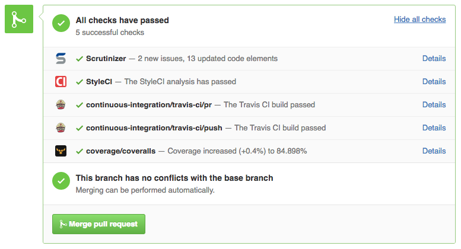

class: title

# Lancez-vous dans l'open source !


---
class: profile

.profile-picture[
    
]

.company-logo[ [](https://wizaplace.com) ]

## Matthieu Napoli

.small[ [github.com/mnapoli](https://github.com/mnapoli) ]

<div class="clear"></div>


- [PHP-DI](http://php-di.org/) - 725★ - 295 000⬇ - 2012
- [Couscous](http://couscous.io) - 399★
- [Silly](https://github.com/mnapoli/silly) - 274★ - 5 500⬇
- …

---

## Open source ?


---

# 2 problèmes de l'open source

---
class: full-image

[](https://www.flickr.com/photos/aigle_dore/5951683083/in/photostream/)

# 1. Mon projet marche pas...

---

# 2. Mon projet marche...

---

## 0. Démarrer son projet
## 1. Trouver des utilisateurs et contributeurs
## 2. Gérer les utilisateurs et contributeurs

---

[Packagist.org](http://packagist.org) : 96 293 packages

---


---


---

# Pourquoi un projet open source "marche" ?

---

# Conteneurs

- Symfony DI: "The DIC is the biggest contributor to the speed and extensibility of Symfony"
--

- Pimple: "A simple DIC"

--
- PHP-DI: "The DIC for humans"

--
- Dice: "Lightweight and fast DIC"

--
- Twittee: "A DIC in a Tweet"

---

.center[  ]

---

## Standards & Conventions

```
src/
tests/
composer.json
```

- PSR-4
- PSR-1 & PSR-2

---

## License MIT [choosealicense.com](http://choosealicense.com/)

---


---



---

## Documentation

- README
- ~~GitHub wiki~~
- GitHub repository
- [Read the Docs](https://readthedocs.org/)
- [Couscous](http://couscous.io)

---

## Semantic Versioning [semver.org](http://semver.org/)

`MAJOR.MINOR.PATCH`

- 0.1.0
- 0.2.0
- 1.0.0

---
class: title

[github.com/mnapoli/project-template](https://github.com/mnapoli/project-template)

---

.full-image[ [](https://www.flickr.com/photos/aigle_dore/5951683083/in/photostream/) ]

---

| Twitter | Reddit [/r/php](http://fr.reddit.com/r/php) |
| --- | --- |
| Traffic | ! Traffic |
| Favs + Retweets | Criticism + Trolls |

---

.center[  ]

---


---


---
class: big

> Don’t try to be everything to everyone.

[Robby Russell](https://medium.freecodecamp.com/d-oh-my-zsh-af99ca54212c) (Oh My Zsh)

---

## À quoi s'attendre ?

- Code : ?
- Documentation : ?
- Support : ?
- Gestion de projet : ?

.footer[ Alexander Makarov (Yii), Jordi Boggiano (Composer), Josh Lockhart (Slim), William Durand, Marco Pivetta (Doctrine, Zend Framework), Matthew Weier O'Phinney (Zend Framework), Paul Dragoonis (PPI), Taylor Otwell (Laravel) ]

---

## À quoi s'attendre ?

- Code : 30%
- Documentation : 15%
- Support : 5%
- Gestion de projet : 50%

.footer[ Alexander Makarov (Yii), Jordi Boggiano (Composer), Josh Lockhart (Slim), William Durand, Marco Pivetta (Doctrine, Zend Framework), Matthew Weier O'Phinney (Zend Framework), Paul Dragoonis (PPI), Taylor Otwell (Laravel) ]

---


---

> I have to stop working on Open Source projects for a while. […] if you are interested in taking the lead on one of my projects…

- [Burnout](http://williamdurand.fr/2013/02/20/burnout/) - William Durand

> As of today I am quitting all maintenance roles/responsibilities of any open source project I am involved in. I am now looking for maintainers…

- [Open source work](http://ryanbigg.com/2015/11/open-source-work/) - Ryan Bigg

---


---


---
class: big

> Have fun!

<br><br>


???

- emails
- notifications
- unhappy users
- haters
