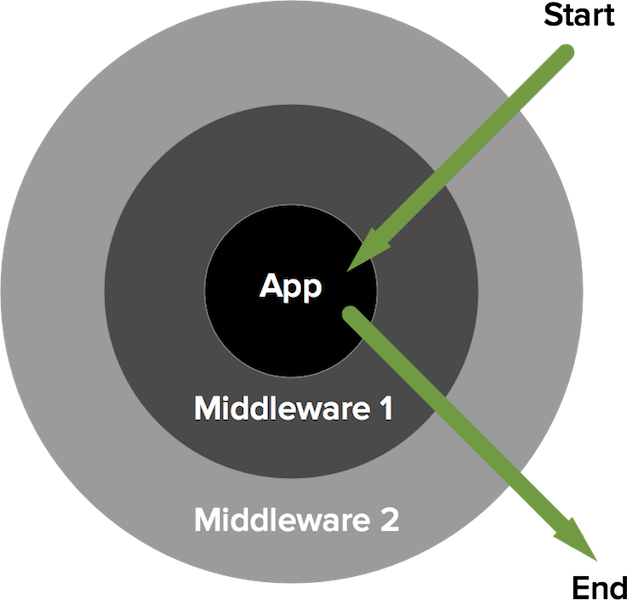

class: title

# Les middlewares en PHP

---

Les middle-what ?

---

```php
$response = middleware($request);
```

---

## Symfony

```php
interface HttpKernelInterface
{
    /**
     * @return Response
     */
    public function handle(Request $request, ...);
}
```

---

## PSR-7

```
composer require psr/http-message
```

- `RequestInterface`
- `ServerRequestInterface`
- `ResponseInterface`
- ...

---

```php
use Psr\Http\Message\ResponseInterface;
use Psr\Http\Message\ServerRequestInterface;

function (ServerRequestInterface $request) : ResponseInterface {
    return new Response('Hello world!');
}
```

.small[
*[Zend Diactoros](https://github.com/zendframework/zend-diactoros)*
]

---
class: title

# Step 1

## write and run a middleware

---

## Step 1: write and run a middleware

Write your first middleware.

The web application (in `index.php`) should show "Hello world!" at [http://localhost:8000](http://localhost:8000/).

---

```

```

---
class: title

# Step 2

## use the request

---

## Step 2: use the request

Use the request so that [http://localhost:8000/?name=Bob](http://localhost:8000/?name=Bob) shows "Hello Bob!"

.small[
*Bonus: [http://localhost:8000/](http://localhost:8000/) should still show "Hello world!"*
]

---

```

```

---
class: title

# Step 3

## compose middlewares to handle errors nicely

---

# TODO: intro to layers



---

## Step 3: compose middlewares to handle errors

Assemble multiple middlewares with a `Pipe`.

```php
$pipe = new Pipe([
    function (...) { ... },
    function (...) { ... },
]);
```

Write an error handler middleware. Place it first in the pipe. It should catch exceptions thrown in next middlewares and show an error page.

.small[
*Bonus: write the error handler middleware as a class.*
]

---

```php
use Psr\Http\Message\ServerRequestInterface as Request;

$application = new Pipe([

    function (Request $request, callable $next) {
        try {
            return $next($request);
        } catch (\Exception $e) {
            $m = $e->getMessage();
            return new TextResponse('Error: '.$m, 500);
        }
    },

    function (Request $request, callable $next) {
        throw new Exception('Test');
    },

]);
```
